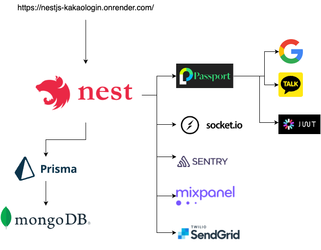

## .env

```bash
MIXPANEL_TOKEN=<Mixpanel Token>
AMPLITUDE_API_KEY=<Amplitude API Key>
SENTRY_DSN=<Sentry DSN>
GMAIL_USER=<yourname@gmail.com>
GMAIL_APP_PASSWORD=<생성된 16자리 앱 비밀번호>

JWT_SECRET=<crypto.randomBytes(16).toString('hex')> or https://randomkeygen.com/, https://keygen.io/
AUTH_COOKIE_NAME=access_token

KAKAO_REST_API_KEY=<Kakao REST API Key>
KAKAO_REDIRECT_URI=<Kakao Redirect URI>
KAKAO_CLIENT_SECRET=<Kakao Client secret code>

GOOGLE_CLIENT_ID=<Google Client ID>
GOOGLE_CLIENT_SECRET=<Google Client Secret>
GOOGLE_REDIRECT_URI=<Google Redirect URI>

APP_PORT=<App Port>
DATABASE_URL="mongodb://${MONGO_USER}:${MONGO_PW}@${MONGO_HOST}:${MONGO_PORT}/${MONGO_DB}?authSource=admin"

SLACK_WEBHOOK_URL=<Slack Webhook URL>
SLACK_CHANNEL=<Slack Channel>
SLACK_USERNAME=<Slack Username>
SLACK_EMOJI=<Slack Emoji>
```

Connect http://localhost:3000
