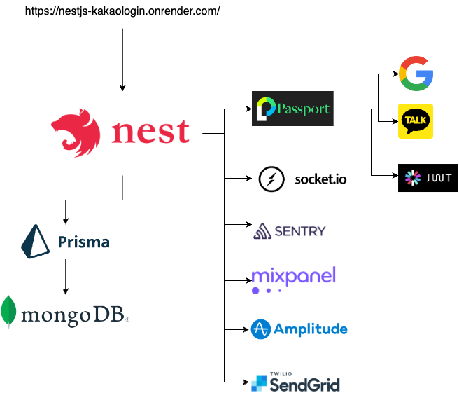

## .env

```bash
MIXPANEL_TOKEN=<Mixpanel Token>
SENTRY_DSN=<Sentry DSN>
SENDGRID_API_KEY=<Sendgrid API Key>
SENDGRID_EMAIL_ADDRESS=<Sendgrid Email Address>

JWT_SECRET=<crypto.randomBytes(16).toString('hex')> or https://randomkeygen.com/, https://keygen.io/
AUTH_COOKIE_NAME=access_token

KAKAO_REST_API_KEY=<Kakao REST API Key>
KAKAO_REDIRECT_URI=<Kakao Redirect URI>
KAKAO_CLIENT_SECRET=<Kakao Client secret code>

GOOGLE_CLIENT_ID=<Google Client ID>
GOOGLE_CLIENT_SECRET=<Google Client Secret>
GOOGLE_REDIRECT_URI=<Google Redirect URI>

APP_PORT=<App Port>
DATABASE_URL="mongodb://${MONGO_USER}:${MONGO_PW}@${MONGO_HOST}:${MONGO_PORT}/${MONGO_DB}?authSource=admin"
```

Connect http://localhost:3000
